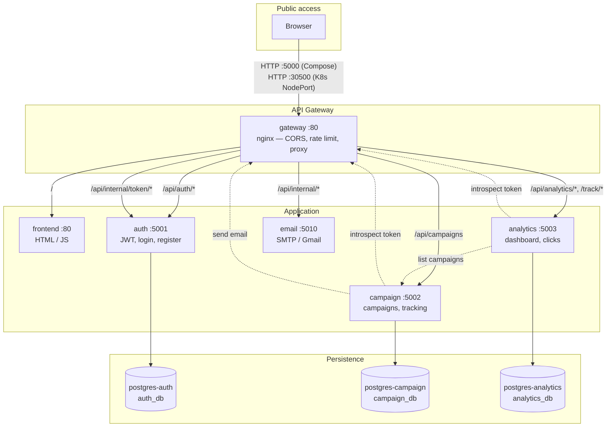
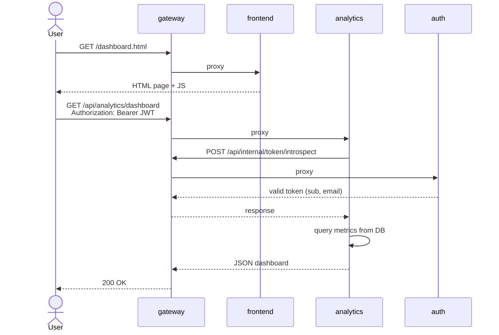

# PhishGuard Console

Phishing simulation platform with a microservices architecture. Create campaigns, send emails with tracking links, record clicks, and view metrics on a dashboard.

**Stack:** Python 3.12 (Flask), PostgreSQL 16, nginx (API Gateway), static frontend (HTML/JS), Docker Compose, and Kubernetes.

---

## Architecture

### Overview



### Authenticated flow (e.g. dashboard)



### Service map

| Service | Internal port | Description |
|---------|---------------|-------------|
| `gateway` | 80 | Reverse proxy, CORS, rate limit, routing |
| `frontend` | 80 | Web UI (login, dashboard, campaigns) |
| `auth` | 5001 | Registration, login, JWT, token introspection |
| `campaign` | 5002 | Campaign CRUD, tracking links, sending |
| `analytics` | 5003 | Dashboard, metrics, click recording |
| `email` | 5010 | Email delivery via SMTP (Gmail) |
| `postgres-*` | 5432 | One PostgreSQL database per service |

All backend services are reachable **only through the gateway** from outside the cluster/network.

---

## Prerequisites

| Tool | Minimum version | Purpose |
|------|-----------------|---------|
| [Docker](https://docs.docker.com/get-docker/) | 24+ | Compose and image builds |
| [Docker Compose](https://docs.docker.com/compose/) | v2 | Local orchestration |
| [kubectl](https://kubernetes.io/docs/tasks/tools/) | 1.28+ | Kubernetes deployment |
| [Helm](https://helm.sh/docs/intro/install/) | 3+ | Vault on Kubernetes |
| Kubernetes cluster | — | Minikube or Kind |
| Python 3.12 | — | Integration tests and pre-commit |
| [jq](https://jqlang.org/) | — | JSON parsing in curl examples (optional) |
| [pre-commit](https://pre-commit.com/) | — | Secret scanning before commit (optional) |

---

## Project structure

```
devsecops2026/
├── compose.yaml              # Docker Compose orchestration
├── .env.example              # Environment variables (copy to .env)
├── deploy-local-k8s.sh       # Build, load, and deploy on Minikube
├── gateway/
│   └── nginx.conf            # API Gateway configuration
├── frontend/                 # Static SPA (HTML + JS)
├── services/
│   ├── auth/                 # Authentication and JWT
│   ├── campaign/             # Campaigns and tracking
│   ├── analytics/            # Metrics and dashboard
│   └── email/                # Email delivery
├── kubernetes/               # K8s manifests (Kustomize)
│   ├── kustomization.yaml
│   ├── config.yaml           # ConfigMap + Secret
│   ├── postgres.yaml
│   ├── gateway.yaml
│   └── ...                   # Um arquivo por serviço
├── terraform/                # IaC AWS (VPC + EC2)
│   └── ...                   # One file per service
├── vault/                    # Helm scripts for HashiCorp Vault
├── docs/                     # Per-microservice documentation
├── scripts/
│   └── setup-pre-commit.sh   # Install pre-commit hooks
├── .pre-commit-config.yaml   # Gitleaks pre-commit hook
├── .gitleaks.toml            # Gitleaks rules and allowlist
├── .semgrep/                 # Custom Semgrep rules
├── .zap/                     # OWASP ZAP rules (DAST)
├── .github/workflows/
│   └── pipeline.yaml         # Full CI/CD pipeline
└── tests/
    └── integration/          # End-to-end tests
```

Detailed documentation by component:

- [Gateway](gateway/README.md)
- [Auth](docs/AUTH.md)
- [Campaign](docs/CAMPAIGN.md)
- [Analytics](docs/ANALYTICS.md)
- [Email](docs/EMAIL.md)

---

## Configuration

### Environment variables (Docker Compose)

```bash
cp .env.example .env
```

Edit `.env` before running in production. Important values:

| Variable | Description | Default |
|----------|-------------|---------|
| `GATEWAY_PORT` | Public gateway port on the host | `5000` |
| `JWT_SECRET_KEY` | Shared JWT secret | change me |
| `INTERNAL_API_KEY` | Inter-service API key | change me |
| `TRACKING_BASE_URL` | Public URL for tracking links | `http://localhost:5000` |
| `GMAIL_*` | SMTP credentials for email delivery | — |

> Migrations run automatically when each Python service starts (`docker-entrypoint.sh`).

### Variables (Kubernetes)

Edit `kubernetes/config.yaml` (ConfigMap + Secret) with the same values as `.env`.

If you change `gateway/nginx.conf`, sync it to K8s:

```bash
cp gateway/nginx.conf kubernetes/nginx.conf
```

---

## Run with Docker Compose

### 1. Prepare environment

```bash
cd /path/to/devsecops2026
cp .env.example .env
```

### 2. Start the stack

```bash
docker compose up -d --build
```

Wait until all containers are healthy:

```bash
docker compose ps
```

### 3. Access

| Resource | URL |
|----------|-----|
| Frontend / API | http://localhost:5000 |
| Login | http://localhost:5000/ |
| Register | http://localhost:5000/register.html |

### 4. Stop and clean up

```bash
# Stop containers
docker compose down

# Stop and remove volumes (database data)
docker compose down -v
```

### 5. Rebuild after code changes

```bash
docker compose up -d --build auth        # one service
docker compose up -d --build             # all services
```

---

## Run with Kubernetes

### 1. Prepare cluster

**Minikube:**

```bash
minikube start
```

**Kind:**

```bash
kind create cluster
```

Confirm access: `kubectl cluster-info`

### 2. Configure secrets

Edit `kubernetes/config.yaml` — especially `INTERNAL_API_KEY`, `JWT_SECRET_KEY`, and `GMAIL_*`.

Set `TRACKING_BASE_URL` according to how you access the app:

| Access method | `TRACKING_BASE_URL` |
|---------------|---------------------|
| NodePort | `http://localhost:30500` |
| Port-forward on port 5000 | `http://localhost:5000` |

### 3. Build images

Manifests use local images (`imagePullPolicy: Never`). Build from the project root:

```bash
docker build -f frontend/Dockerfile           -t frontend:latest .
docker build -f services/auth/Dockerfile      -t auth:latest .
docker build -f services/campaign/Dockerfile  -t campaign:latest .
docker build -f services/analytics/Dockerfile -t analytics:latest .
docker build -f services/email/Dockerfile     -t email:latest .
```

**Minikube / Kind** — load images into the cluster:

```bash
# Minikube
minikube image load frontend:latest
minikube image load auth:latest
minikube image load campaign:latest
minikube image load analytics:latest
minikube image load email:latest

# Kind
kind load docker-image frontend:latest auth:latest campaign:latest analytics:latest email:latest
```

> With **Kind** or **Minikube**, you must load images into the cluster (see above).

### 4. Deploy

**Automated script (Minikube):**

```bash
./deploy-local-k8s.sh
```

The script builds images, loads them into Minikube, applies manifests, and starts port-forward on port 5000.

**Manual:**

```bash
kubectl apply -k kubernetes/
```

Verify pods:

```bash
kubectl get pods
kubectl wait --for=condition=ready pod --all --timeout=180s
```

### 5. Access

**Option A — NodePort (direct):**

```
http://localhost:30500
```

**Option B — Port-forward (port 5000, same as Compose):**

```bash
kubectl port-forward svc/gateway 5000:80
```

Open: http://localhost:5000

### 6. Update after code changes

```bash
docker build -f services/auth/Dockerfile -t auth:latest .
kubectl rollout restart deployment/auth
```

Or reapply everything:

```bash
kubectl apply -k kubernetes/
```

### 7. Vault (secrets on Kubernetes)

On Kubernetes, sensitive credentials (JWT, SMTP, database passwords) can be injected via [HashiCorp Vault](https://www.vaultproject.io/) with the Agent Injector sidecar.

Prerequisites: Helm 3+, cluster with webhook support.

```bash
# Reads values from .env (or defaults) and configures Vault + secrets
./vault/deploy-vault.sh
```

The script installs Vault via Helm, initializes and unseals the cluster, writes secrets to `secret/my-app/env`, configures Kubernetes auth, and restarts application pods.

> **Important:** save the root token shown during initialization. Without Vault, pods use values from `kubernetes/config.yaml`.

In CI, the pipeline runs `vault/deploy-vault-ci.sh` (fixed values for automated tests).

### 8. Remove

```bash
kubectl delete -k kubernetes/

# Remove persistent volumes (database data)
kubectl delete pvc auth-pg-data campaign-pg-data analytics-pg-data

# Remove Vault (if installed)
helm uninstall vault -n vault
kubectl delete namespace vault
```

---

## AWS provisioning (Terraform)

Minimal setup: VPC, security group, and EC2 with Docker. See [`terraform/README.md`](terraform/README.md).

```powershell
cd terraform
Copy-Item terraform.tfvars.example terraform.tfvars
# Edit ssh_key_name and allowed_ssh_cidr

terraform init
terraform apply
```

Then SSH into the instance, clone the repo, and run `docker compose up -d --build`. The app URL will be `http://<PUBLIC_IP>:5000`.

---

## Testar se está funcionando

### Quick checklist

```bash
# Compose
docker compose ps                              # all running/healthy
curl -sf -o /dev/null -w "HTTP %{http_code}\n" http://localhost:5000/

# Kubernetes
kubectl get pods                               # all Running
curl -sf -o /dev/null -w "HTTP %{http_code}\n" http://localhost:30500/
```

### Manual API flow

```bash
base="http://localhost:5000"   # or :30500 on K8s with NodePort

# Register
curl -s -X POST "$base/api/auth/register" \
  -H "Content-Type: application/json" \
  -d '{"email":"test@example.com","password":"Password1!","name":"Test User"}'

# Login
login=$(curl -s -X POST "$base/api/auth/login" \
  -H "Content-Type: application/json" \
  -d '{"email":"test@example.com","password":"Password1!"}')
token=$(echo "$login" | jq -r '.token')

# Dashboard (analytics)
curl -s "$base/api/analytics/dashboard" \
  -H "Authorization: Bearer $token"
```

### Automated tests

With the Compose stack running:

```bash
pip install -r requirements.txt
python -m pytest tests/integration/test_flow.py -v
```

On Kubernetes (adjust the URL):

```bash
export INTEGRATION_BASE_URL="http://localhost:30500"
export INTERNAL_API_KEY="change-me-internal-key"
python -m pytest tests/integration/test_flow.py -v
```

The test covers: **auth → campaign → tracking → analytics → logout**.

---

## Route map (gateway)

| Route | Service | Methods |
|-------|---------|---------|
| `/` | frontend | GET |
| `/api/auth/*` | auth | POST, OPTIONS |
| `/api/campaigns` | campaign | GET, POST, PUT, DELETE |
| `/api/analytics/*` | analytics | GET |
| `/track/*` | analytics | GET, POST |
| `/api/internal/token/*` | auth | POST (internal) |
| `/api/internal/*` | email | POST (internal) |

---

## Troubleshooting

### Docker Compose

| Problem | Solution |
|---------|----------|
| Port 5000 in use | Change `GATEWAY_PORT` in `.env` |
| Auth won't start | `docker compose logs auth` — wait for postgres-auth healthy |
| Email not sending | Configure `GMAIL_*` in `.env` |
| nginx config change | `docker compose exec gateway nginx -t && docker compose restart gateway` |

### Kubernetes

| Problem | Solution |
|---------|----------|
| `ImagePullBackOff` | Rebuild images; `imagePullPolicy: Never` requires a local image |
| `Authentication service unavailable` on dashboard | `gateway` service must expose port **80** internally (`http://gateway`); reapply `kubernetes/gateway.yaml` |
| Broken tracking links | Set `TRACKING_BASE_URL` in `config.yaml` to the correct public URL |
| Pod restarting | `kubectl logs deployment/<name>` and `kubectl describe pod <name>` |
| Inconsistent `INTERNAL_API_KEY` | Same value in ConfigMap and all services |

### View logs

```bash
# Compose
docker compose logs -f auth campaign analytics

# Kubernetes
kubectl logs -f deployment/auth
kubectl logs -f deployment/gateway
```

---

## Security and DevSecOps

### Pre-commit (local)

Before each commit, [Gitleaks](https://github.com/gitleaks/gitleaks) scans the repository for exposed secrets.

**Install:**

```bash
./scripts/setup-pre-commit.sh
```

Configuration in [`.pre-commit-config.yaml`](.pre-commit-config.yaml) and [`.gitleaks.toml`](.gitleaks.toml). Documentation, example, and test paths are on the allowlist.

**Run manually:**

```bash
pre-commit run --all-files
```

### Security tools

| Tool | Config | Purpose |
|------|--------|---------|
| Gitleaks | `.gitleaks.toml` | Secret detection (pre-commit + CI) |
| Semgrep | `.semgrep/custom-rules.yaml` | SAST — custom rules (hardcoded secrets, etc.) |
| OWASP ZAP | `.zap/rules.tsv` | DAST — baseline scan against the gateway |
| FOSSA | — | License and dependency audit |

---

## CI/CD

The pipeline in [`.github/workflows/pipeline.yaml`](.github/workflows/pipeline.yaml) runs in sequence:

| Job | Description |
|-----|-------------|
| **Secret Scanning** | Gitleaks over full repository history |
| **Integration tests** | `docker compose up --build` + `pytest tests/` |
| **Semgrep** | Custom rules (`.semgrep/`) + `semgrep ci` |
| **FOSSA** | Dependency analysis (requires `FOSSA_APP_TOKEN`) |
| **DAST** | OWASP ZAP baseline against `http://gateway` (report as artifact) |
| **K8s integration tests** | Minikube + Vault CI + deploy + `pytest` via port-forward |

Required GitHub secrets: `SEMGREP_APP_TOKEN`, `FOSSA_APP_TOKEN`.

Triggers: push/PR to `main` or `workflow_dispatch`.

---

## Local development (without Docker for the app)

Start only the databases:

```bash
docker compose up -d postgres-auth postgres-campaign postgres-analytics
python3 -m venv .venv
source .venv/bin/activate
pip install -r requirements.txt
```

Configure local URLs (see `.env.example`) and run each service separately. See per-microservice docs in [`docs/`](docs/).

---

## License

Academic project — DevSecOps (Final Project).
