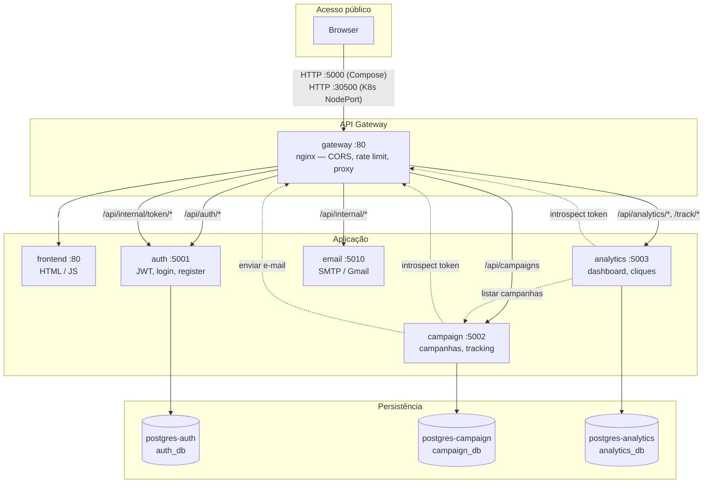
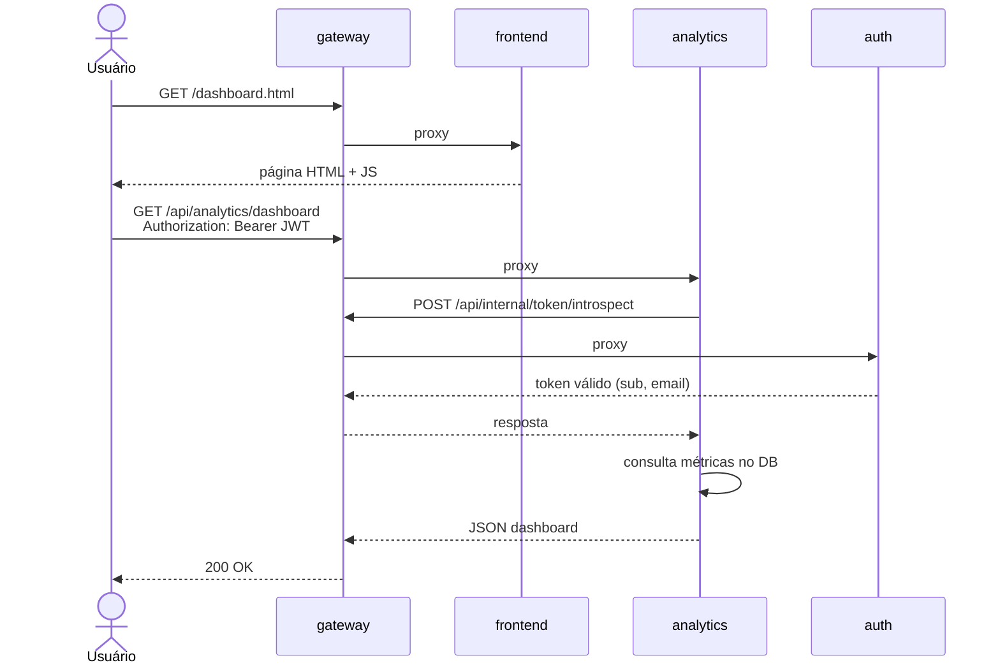

# PhishGuard Console

Plataforma de simulação de phishing com arquitetura de microserviços. Permite criar campanhas, enviar e-mails com links de rastreamento, registrar cliques e visualizar métricas em um dashboard.

**Stack:** Python 3.12 (Flask), PostgreSQL 16, nginx (API Gateway), frontend estático (HTML/JS), Docker Compose e Kubernetes.

---

## Arquitetura

### Visão geral



### Fluxo autenticado (ex.: dashboard)



### Mapa de serviços

| Serviço | Porta interna | Descrição |
|---------|---------------|-----------|
| `gateway` | 80 | Proxy reverso, CORS, rate limit, roteamento |
| `frontend` | 80 | Interface web (login, dashboard, campanhas) |
| `auth` | 5001 | Registro, login, JWT, introspecção de token |
| `campaign` | 5002 | CRUD de campanhas, links de tracking, envio |
| `analytics` | 5003 | Dashboard, métricas, registro de cliques |
| `email` | 5010 | Envio de e-mails via SMTP (Gmail) |
| `postgres-*` | 5432 | Um banco PostgreSQL por serviço |

Todos os serviços backend são acessíveis **apenas via gateway** a partir do exterior.

---

## Pré-requisitos

| Ferramenta | Versão mínima | Uso |
|------------|---------------|-----|
| [Docker](https://docs.docker.com/get-docker/) | 24+ | Compose e build de imagens |
| [Docker Compose](https://docs.docker.com/compose/) | v2 | Orquestração local |
| [kubectl](https://kubernetes.io/docs/tasks/tools/) | 1.28+ | Deploy Kubernetes |
| Cluster Kubernetes | — | Docker Desktop K8s, Minikube ou Kind |
| Python 3.12 | — | Testes de integração locais |

---

## Estrutura do projeto

```
ProjetoFinal/
├── compose.yaml              # Orquestração Docker Compose
├── .env.example              # Variáveis de ambiente (copiar para .env)
├── gateway/
│   └── nginx.conf            # Configuração do API Gateway
├── frontend/                 # SPA estática (HTML + JS)
├── services/
│   ├── auth/                 # Autenticação e JWT
│   ├── campaign/             # Campanhas e tracking
│   ├── analytics/            # Métricas e dashboard
│   └── email/                # Envio de e-mails
├── kubernetes/               # Manifests K8s (Kustomize)
│   ├── kustomization.yaml
│   ├── config.yaml           # ConfigMap + Secret
│   ├── postgres.yaml
│   ├── gateway.yaml
│   └── ...                   # Um arquivo por serviço
└── tests/
    └── integration/          # Testes end-to-end
```

Documentação detalhada por componente:

- [Gateway](gateway/README.md)
- [Auth](services/auth/README.md)
- [Campaign](services/campaign/README.md)
- [Analytics](services/analytics/README.md)
- [Email](services/email/README.md)

---

## Configuração

### Variáveis de ambiente (Docker Compose)

```powershell
Copy-Item .env.example .env
```

Edite `.env` antes de subir em produção. Valores importantes:

| Variável | Descrição | Padrão |
|----------|-----------|--------|
| `GATEWAY_PORT` | Porta pública do gateway no host | `5000` |
| `JWT_SECRET_KEY` | Segredo compartilhado para JWT | alterar |
| `INTERNAL_API_KEY` | Chave entre microserviços | alterar |
| `TRACKING_BASE_URL` | URL pública dos links de tracking | `http://localhost:5000` |
| `GMAIL_*` | Credenciais SMTP para envio de e-mail | — |

> As migrations rodam automaticamente ao iniciar cada serviço Python (`docker-entrypoint.sh`).

### Variáveis (Kubernetes)

Edite `kubernetes/config.yaml` (ConfigMap + Secret) com os mesmos valores do `.env`.

Se alterar `gateway/nginx.conf`, sincronize com o K8s:

```powershell
Copy-Item gateway\nginx.conf kubernetes\nginx.conf
```

---

## Executar com Docker Compose

### 1. Preparar ambiente

```powershell
cd /caminho/para/ProjetoFinal
Copy-Item .env.example .env
```

### 2. Subir o stack

```powershell
docker compose up -d --build
```

Aguarde todos os containers ficarem healthy:

```powershell
docker compose ps
```

### 3. Acessar

| Recurso | URL |
|---------|-----|
| Frontend / API | http://localhost:5000 |
| Login | http://localhost:5000/ |
| Registro | http://localhost:5000/register.html |

### 4. Parar e limpar

```powershell
# Parar containers
docker compose down

# Parar e apagar volumes (dados dos bancos)
docker compose down -v
```

### 5. Rebuild após mudança no código

```powershell
docker compose up -d --build auth        # um serviço
docker compose up -d --build             # todos
```

---

## Executar com Kubernetes

### 1. Preparar cluster

**Docker Desktop (recomendado no Windows):**

1. Docker Desktop → Settings → Kubernetes → Enable Kubernetes
2. Confirme: `kubectl cluster-info`

**Minikube:**

```powershell
minikube start
```

### 2. Configurar secrets

Edite `kubernetes/config.yaml` — especialmente `INTERNAL_API_KEY`, `JWT_SECRET_KEY` e `GMAIL_*`.

Ajuste `TRACKING_BASE_URL` conforme o acesso:

| Forma de acesso | `TRACKING_BASE_URL` |
|-----------------|---------------------|
| NodePort | `http://localhost:30500` |
| Port-forward na porta 5000 | `http://localhost:5000` |

### 3. Build das imagens

Os manifests usam imagens locais (`imagePullPolicy: Never`). Build na raiz do projeto:

```powershell
docker build -f frontend/Dockerfile           -t frontend:latest .
docker build -f services/auth/Dockerfile      -t auth:latest .
docker build -f services/campaign/Dockerfile  -t campaign:latest .
docker build -f services/analytics/Dockerfile -t analytics:latest .
docker build -f services/email/Dockerfile     -t email:latest .
```

**Minikube / Kind** — carregue as imagens no cluster:

```powershell
# Minikube
minikube image load frontend:latest
minikube image load auth:latest
minikube image load campaign:latest
minikube image load analytics:latest
minikube image load email:latest

# Kind
kind load docker-image frontend:latest auth:latest campaign:latest analytics:latest email:latest
```

> Com **Docker Desktop Kubernetes**, as imagens locais já ficam disponíveis — não é necessário carregar.

### 4. Deploy

```powershell
kubectl apply -k kubernetes/
```

Verifique os pods:

```powershell
kubectl get pods
kubectl wait --for=condition=ready pod --all --timeout=180s
```

### 5. Acessar

**Opção A — NodePort (direto):**

```
http://localhost:30500
```

**Opção B — Port-forward (porta 5000, igual ao Compose):**

```powershell
kubectl port-forward svc/gateway 5000:80
```

Acesse: http://localhost:5000

### 6. Atualizar após mudança no código

```powershell
docker build -f services/auth/Dockerfile -t auth:latest .
kubectl rollout restart deployment/auth
```

Ou reaplique tudo:

```powershell
kubectl apply -k kubernetes/
```

### 7. Remover

```powershell
kubectl delete -k kubernetes/

# Remover volumes persistentes (dados dos bancos)
kubectl delete pvc auth-pg-data campaign-pg-data analytics-pg-data
```

---

## Testar se está funcionando

### Checklist rápido

```powershell
# Compose
docker compose ps                              # todos running/healthy
Invoke-WebRequest http://localhost:5000/       # StatusCode 200

# Kubernetes
kubectl get pods                               # todos Running
Invoke-WebRequest http://localhost:30500/      # StatusCode 200 (NodePort)
```

### Fluxo manual (API)

```powershell
$base = "http://localhost:5000"   # ou :30500 no K8s com NodePort

# Registro
Invoke-RestMethod -Uri "$base/api/auth/register" -Method POST `
  -ContentType "application/json" `
  -Body '{"email":"test@example.com","password":"Password1!","name":"Test User"}'

# Login
$login = Invoke-RestMethod -Uri "$base/api/auth/login" -Method POST `
  -ContentType "application/json" `
  -Body '{"email":"test@example.com","password":"Password1!"}'

$headers = @{ Authorization = "Bearer $($login.token)" }

# Dashboard (analytics)
Invoke-RestMethod -Uri "$base/api/analytics/dashboard" -Headers $headers
```

### Testes automatizados

Com o stack Compose rodando:

```powershell
pip install -r requirements.txt
python -m pytest tests/integration/test_flow.py -v
```

No Kubernetes (ajuste a URL):

```powershell
$env:INTEGRATION_BASE_URL = "http://localhost:30500"
$env:INTERNAL_API_KEY = "change-me-internal-key"
python -m pytest tests/integration/test_flow.py -v
```

O teste cobre: **auth → campanha → tracking → analytics → logout**.

---

## Mapa de rotas (gateway)

| Rota | Serviço | Métodos |
|------|---------|---------|
| `/` | frontend | GET |
| `/api/auth/*` | auth | POST, OPTIONS |
| `/api/campaigns` | campaign | GET, POST, PUT, DELETE |
| `/api/analytics/*` | analytics | GET |
| `/track/*` | analytics | GET, POST |
| `/api/internal/token/*` | auth | POST (interno) |
| `/api/internal/*` | email | POST (interno) |

---

## Troubleshooting

### Docker Compose

| Problema | Solução |
|----------|---------|
| Porta 5000 em uso | Altere `GATEWAY_PORT` no `.env` |
| Auth não sobe | `docker compose logs auth` — aguarde postgres-auth healthy |
| E-mail não envia | Configure `GMAIL_*` no `.env` |
| Mudança no nginx | `docker compose exec gateway nginx -t && docker compose restart gateway` |

### Kubernetes

| Problema | Solução |
|----------|---------|
| `ImagePullBackOff` | Rebuild das imagens; `imagePullPolicy: Never` exige imagem local |
| `Authentication service unavailable` no dashboard | Service `gateway` deve expor porta **80** internamente (`http://gateway`); reaplique `kubernetes/gateway.yaml` |
| Tracking links quebrados | Ajuste `TRACKING_BASE_URL` em `config.yaml` para a URL pública correta |
| Pod reiniciando | `kubectl logs deployment/<nome>` e `kubectl describe pod <nome>` |
| `INTERNAL_API_KEY` inconsistente | Mesmo valor no ConfigMap e em todos os serviços |

### Ver logs

```powershell
# Compose
docker compose logs -f auth campaign analytics

# Kubernetes
kubectl logs -f deployment/auth
kubectl logs -f deployment/gateway
```

---

## CI/CD

O pipeline em [`.github/workflows/pipeline.yaml`](.github/workflows/pipeline.yaml) executa:

1. **Integration tests** — `docker compose up --build` + `pytest`
2. **Semgrep** — análise estática de segurança
3. **FOSSA** — auditoria de dependências

---

## Desenvolvimento local (sem Docker para o app)

Suba apenas os bancos:

```powershell
docker compose up -d postgres-auth postgres-campaign postgres-analytics
python -m venv .venv
.\.venv\Scripts\pip install -r requirements.txt
```

Configure as URLs locais (ver `.env.example`) e rode cada serviço separadamente. Consulte o README de cada microserviço em `services/*/README.md`.

---

## Licença

Projeto acadêmico — DevSecOps (Projeto Final).
